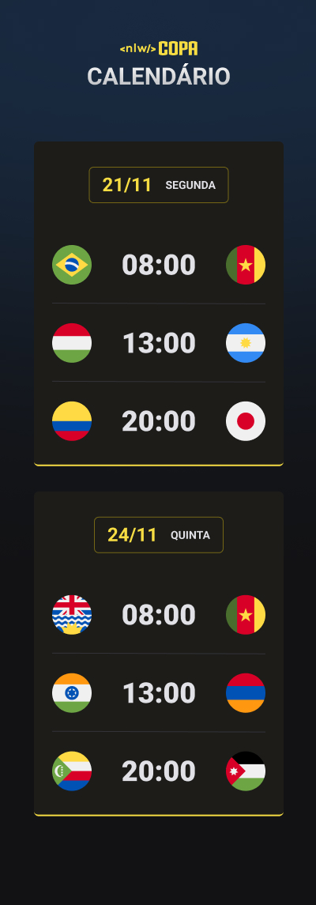
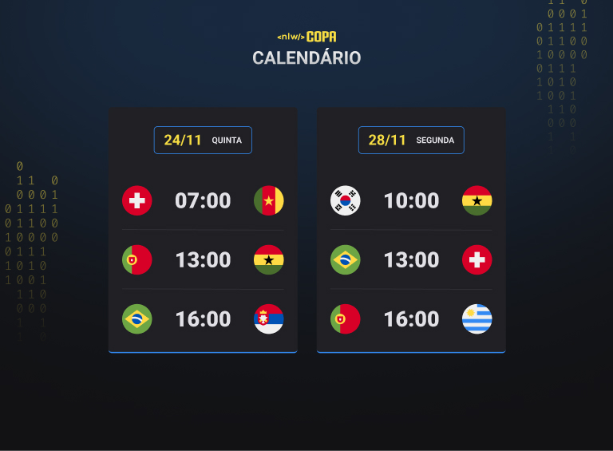

# NLW COPA  

## 1.Introdução  
A Copa do Mundo de futebol é um dos maiores eventos esportivos e acontece de quatro em quatro anos. O Brasil é o maior campeão desta competição com 5 títulos, acompanhado de Itália e Alemanha logo em seguida (4 títulos para cada uma).  
O NLW, por sua vez, é um evento gratuito oferecido pela [Rocketseat](https://www.rocketseat.com.br/). O evento se dá durante uma semana inteira a fim de ensinar conceitos básicos e avançados sobre desenvolvimento web e de aplicativos. Esta edição (a décima) foi dividida em duas trilhas: ***Explorer*** (para quem tem pouca ou nenhuma experiência com desenvolvimento) e ***Ignite*** (para quem tem alguma experiência com desenvolvimento). Nesta edição, a trilha ***Explorer*** desenvolveu um calendário de jogos da Copa, enquanto a trilha ***Ignite*** desenvolveu um aplicativo para realizar um bolão para a Copa.  

## 2.Quem sou eu, meu background e minha trilha  
Olá! Eu sou o Bryan! Sou Engenheiro Bioquímico brasileiro formado em Abril de 2022. Sempre tive muito apreço por tecnologia, desenvolvimento e programação, mas só recentemente resolvi começar a estudar mais a fundo na área (a partir do NLW eSports, para ser mais preciso).  
Comecei a me envolver com programação no fim de 2019. No começo de 2020 (já durante a pandemia), fui selecionado para um minicurso de Python que foi oferecido pela Stanford University (***Code In Place***). Estudei o minicurso e fiquei realmente apaixonado pela área de desenvolvimento. Após quatro semanas, estava apto a criar meu [projeto final](https://github.com/bryrrea/code_generator_to_boxes_of_medicines).  
Algum tempo depois, a Rocketseat ofereceu o [*WorkshopDev* Especial](https://www.youtube.com/playlist?list=PL85ITvJ7FLohGTWaE_p0J6B-TLmQbN4ka), onde foi construída uma aplicação que serviria como um hub de ideias e estudos. Infelizmente não consegui ir até o final daquele semana especial (pois adoeci), mas foi ali que me apaixonei por desenvolvimento web. Contudo, as aulas da faculdade voltaram em seguida na modalidade "emergencial" (foi o nome que deram pra não dizer que seria EaD) e ficou impraticável estudar Engenharia e Desenvolvimento ao mesmo tempo, uma vez que os professores da faculdade nos enchiam de atividades para maquiar as inseguranças e falta de didática deles.  
Após me formar em Abril desse ano, passei a estudar Análise de Dados mais a fundo, e relembrei minha vontade de estudar desenvolvimento web quando recebi o convite de inscrição da Rocketseat para o [NLS eSports](https://github.com/bryrrea/nlw-esports-explorer). Após o evento, criei meu primeiro projeto front-end "solo": um agregador de links chamado [linkhub](https://bryrrea.github.io/linkhub). Utilizei apenas HTML e CSS para criar essa página.  
Atualmente, faço as lições do curso da Free Code Camp e, para treinar, comecei a "reinventar" os projetos que eles utilizam no curso. Dei o nome de [*Free Code Camp Remake*](https://github.com/bryrrea/FreeCodeCampRemake) para este projeto pessoal. Além disso, curso a [trilha *Discover*](https://app.rocketseat.com.br/discover) da Rocketseat (um curso introdutório de desenvolvimento web disponibilizado gratuitamente pelos educadores), e o bootcamp [*Orange Tech+*](https://web.dio.me/track/81278323-8916-401b-8446-03118eaff280) (da DIO em parceria com o Banco Inter). Portanto, por ser iniciante, estou novamente participando da trilha *Explorer*.  

## 3.Tecnologias e ferramentas utilizadas  

|    |
|:--:|

## 4.Protótipo do projeto  

 |**Versão mobile**|**Versão desktop**|
 |:---------------:|:----------------:|    
|| |  

## 5.Estrutura HTML  
Como é possível observar nas imagens acima, na versão mobile é desejável que os cartões estejam um abaixo do outro, enquanto na versão desktop é desejável que os cartões estejam um ao lado do outro. Assim, devemos utilizar um conceito conhecido como ***"mobile first"***, isto é, desenvolvemos a aplicação primeiro pensando nos dispositivos móveis para depois pensarmos em tamanhos de tela maiores.  
Com isso em mente, a aplicação foi desenvolvida com a seguinte estrutura:  

 - O elemento `<head></head>` informações vitais da aplicação, como elementos `<meta />` para designar os caracteres e responsividade da aplicação, além de elementos `<link />` para apontar aos links da fonte utilizada (Roboto) e para apontar para o arquivo css;
 - O `<body></body>` contém tudo que há de importante para aparecer na tela do usuário, além do script que automatizará a criação dos cartões;
 - Dentro do `<body></body>`, temos um `<header></header>` com o logo do NLW Copa e com a "chamada" da aplicação ("Calendário);
 - Foi criada uma `<div></div>` com uma ***id*** "app" e dentro dessa div temos toda a aplicação;
 - Dentro do "app" temos o `<main></main>`, isto é, temos todos os *cards* dentro desse elemento. Por isso, este elemento recebe o atributo ***id*** "*cards*";
 - Dentro do `<main></main>` temos uma `<div></div>` com atributo ***class*** "card". Este elemento representará cada cartão que aparecerá na tela. Em cada cartão, temos:
    - Um elemento `<h2></h2>` contendo a data e um elemento `<strong></strong>` contendo o dia da semana em que a partida ocorrerá;
    - Como o agrupamento dos jogos é por data, podemos tratar cada jogo de uma mesma data como um elemento de uma lista não-ordenada. Portanto, utilizamos o elemento `<ul></ul>` para criar uma lista não ordenada para cada data, e cada jogo dentro da `<ul></ul>` é armazenado em um elemento `<li></li>`;
    - Cada elemento `<li></li>` apresenta dois elementos `` (um para cada seleção da partida), e um elemento `<strong></strong>` (para destacar o horário da partida). As `` contêm o local onde as bandeiras das seleções foram salvas (em vetores *svg*).  

## 6.Regras CSS  

### 6.1.Geral  

 - Foi realizado um ***reset*** das propriedades ***`margin`*** e ***`padding`***, visto que os navegadores originalmente apresentam valores próprios para essas propriedades. Além disso, foi definida a propriedade `box-sizing` para `border-box`, garantindo que as caixas levassem em conta o conteúdo, as bordas, o ***`margin`*** e **`padding`** no cálculo do tamanho das mesmas;
 - A fonte "Roboto" foi definida para todo o `<body></body>`;
 - O papel de parede da aplicação foi fornecido no protótipo da mesma. A imagem foi inicialmente posicionada ao centro na horizontal e em 68% da vertical, garantindo que o layout do papel de parede ficasse fiel ao apresentado no protótipo;
 - Ainda pensando no fundo da tela, foi incorporada uma cor (#121214) para fazer um efeito interessante com o papel de parede;
 - Quanto ao posicionamento, em suma, aproveitou-se dos elementos que originalmente possuem  ***display inline*** para que fossem dispostos lado a lado, assim como foi utilizado o modelo ***Flexbox*** para poder posicionar os demais elementos na tela.  

### 6.2.*Cards*  

 - Para que os *cards* ficassem um abaixo do outro, utilizou-se a propriedade `flex-direction: column;` para que cada card ocupasse uma linha em uma única coluna;
 - As bordas dos *cards* foram arredondadas, além de a borda inferior de cada card receber uma cor amarela;
 - Com a utilização do modelo ***Flexbox***, foi desbloqueada a propriedade ***gap*** (responsável por produzir um espaçamento entre os elementos contidos dentro de um mesmo elemento pai);
 - O modelo ***Flexbox*** irá facilitar a responsividade da aplicação;
 - A propriedade ***`justify-content`*** dos elementos `<li></li>` foi definida para ***`space-between`*** para que os elementos dentro de cada `<li></li>` apresentassem um certo espaçamento horizontal entre si;
 - A data e o dia da semana aparecem em uma caixa com bordas arredondadas. Essas bordas também recebem uma cor própria;
 - As `` contendo os *svg* foram redimensionadas para 50X50 px;
 - Os espaçamentos entre os elementos foram definidos pela propriedade ***`margin`***, e o preenchimento dos elementos foi definido pela propriedade ***`padding`***. Foram definidos diversos e diferentes tipos e medidas (em pixel) de ***`margin`*** e ***`padding`***;
 - A propriedade ***`width`*** foi definida como ***`fit-content`*** para que o conteúdo se adaptasse à largura disponível para distribuição em alguns elementos, como no ***`#app`*** e no elemento `<h2></h2>` do ***`.card`***;
 - O conteúdo do elemento `<span></span>` foi escrito totalmente em minúsculo para que pudéssemos utilizar a propriedade ***`text-transform`***, definida como ***uppercase`*** (todos caracteres em maiúsculo).  

### 6.3.Textos e listas  

 - Os textos apresentam dois tamanhos e tipos de fonte: tamanhos 14 e 36 px; tipos 700 (bold) e 900 (black). Todos os textos apresentam a mesma cor (#e1e1e6), exceto os elementos `<h2></h2>` (#f7dd43);
 - As decorações de lista (bolinhas) foram retiradas;
 - Cada item da lista apresenta um borda superior com uma cor própria para indicar uma separação entre as partidas.  

## 7.*Script*  
Foi escrito um ***script*** para que houvesse uma introdução ao JavaScript. O objetivo do ***script*** foi automatizar um pouco a criação dos *cards*, uma vez que seria um trecho de código HTML que se repetiria diversas vezes no HTML da aplicação. Para isso, foram criadas duas funções:  

 - Função *createGame*: Esta função recebe como atributo uma seleção, um horário, e outra seleção (*player1*, *hour*, e *player2*). Dentro dela, pede-se que seja retornado os elementos `<li></li>` e seus componentes (a imagem da seleção 1, o horário e a imagem da seleção 2). Isto é feito através de interpolação, uma vez que os arquivos svg contendo a bandeira das seleções foram nomeados seguindo um padrão ("*icon-seleção.svg*", o qual é substituído na interpolação por `icon-${player1}.svg`, por exemplo);
 - Função *createCard*: Esta função recebe como atributo uma data (*date*), um dia da semana (*day*) e as partidas (*games*). Nela, serão criados os elementos HTML necessários para a construção dos *cards* diários dos jogos. Novamente, a substituição é feita por interpolação, em que *date* e *day* são alocados nos elementos `<h2></h2>` e `<span></span>` dos *cards*, enquanto o atributo *games* é inserido no elemento `<ul></ul>`.  

>OBS: Os elementos utilizados na construção dos *cards* foram movidos do documento HTML para o ***script***, remanescendo apenas a ***div*** principal (***`#app`***) no ***body*** do HTML (além do ***script***, é claro).  

O script é rodado dentro do próprio `main.js`. Acredito que o melhor seria separar as duas funções em dois arquivos js diferentes, uma vez que são duas "funcionalidades" diferentes. Isso ajudaria a deixar tudo mais organizado (ao meu ver), pois o script chamaria as duas funções como módulos/funcionalidades.  

## 8.Responsividade  
A responsividade é o que assegura que o front-end irá aparecer em todos os tamanhos de tela sem erro ou quebra. O layout pode ser um pouco diferente, mas sem ser acidentalmente quebrado por não se adaptar ao tamanho de uma tela. É por isso que é comum a utilização do modelo *"mobile first"*, visto que é muito comum novos desenvolvedores não se darem conta de que o layout de seu app ou site pode quebrar quando exibido em dispositivos móveis.  
A responsividade é lidada no CSS com o uso de ***`@media`***. Ela deve ser seguida de um tamanho e, após isso, as propriedades podem ser escritas normalmente dentro dos seletores.  

```css
@media (max-width: 700px) {
    seletor {
        propriedade01: valor01;
        propriedade02: valor02;
    }    
}
```  

Como é possível observar acima, definiu-se um tamanho máximo de 700 px para que as propriedades 01 e 02 originais fossem alteradas.  
Neste projeto, foi definido um valor mínimo de 700 px para que algumas propriedades fossem alteradas, isto é, tais propriedades irão mudar apenas na tela de dispositivos com um ***viewport*** (área de uso do navegador do usuário) maior que 700 px. Além disso, segundo o protótipo, é desejável que a versão *desktop* apresente dois cartões por linha (um ao lado outro). Abaixo, segue o trecho que irá alterar o layout da página em dispositivos com telas que apresentam *viewport* maior que 700 px:  

```css
@media (min-width: 700px) {
    #cards {
        flex-direction: row;
        flex-wrap: wrap;
        max-width: 670px;
    }
}
```  

Como em tamanhos de tela comuns para *mobile* foi originalmente definido que a direção do *Flexbox* deveria ser *columns*, para dispositivos com telas maiores é desejável que a propriedade ***`flex-direction`*** seja alterada para *row*. Para que apenas dois cartões apareçam por linha, foi necessário fazer um cálculo levando em conta a largura de dois cartões mais o espaçamento entre eles (que é originalmente 32 px). Assim, concluiu-se que a largura máxima (***`max-width`***) aceitável em uma linha para comportar dois cartões é 670 px. Finalmente, a propriedade ***`flex-wrap`*** foi definida como ***`wrap`***, uma vez que que esta propriedade garante que um terceiro cartão seja colocado abaixo dos dois. Vale salientar que a altura dos cartões alinhados em uma mesma linha sempre será igual à altura do maior cartão naquela linha.  

## 9.Animações  
As animações são escritas no documento CSS. Para este projeto, foi proposta uma animação em que os cartões surgem de cima para baixo, um após o outro.  
No documento CSS, as animações são criadas a partir do ***`@keyframes`***. Cada animação deve possuir um nome para que possa ser chamada no seletor onde ocorrerá o efeito. Esse chamamento é realizado a partir da propriedade ***`animation`***.  
Nós só trabalhamos com 3 cartões nesse exemplo de código e, assim, a animação de transição dos cartões poderia ser feita manualmente dentro do próprio CSS a partir do pseudo-seletor ***nth-child***. Contudo, como não seriam apenas 3 cartões na app original, faz-se necessário a automação das transições. Para isso, criou-se uma variável no ***script*** capaz de controlar o tempo de transição. Essa variável foi interpolada dentro do atributo ***style*** do elemento ***div*** que recebe o ***id card***, isto é, essa variável é incrementada **dentro** da função ***createCard***.  

## 10.Estilizando o projeto  
No protótipo do projeto (disponibilizado no [Figma](https://www.figma.com/file/DMEo8R17aIzn7qjVmAYzoW/Calend%C3%A1rio-de-Jogos-(Community)?node-id=0%3A1)), é possível observar que algumas cores podem ser alternadas entre verde, amarelo e azul (cores da seleção brasileira). A cor da borda inferior dos cartões e a cor do plano de fundo são os estilos que podem ser alternados neste projeto.  Para isso, variáveis devem ser criadas no CSS para que seja possível fazer as mudanças baseadas nelas.  
Quatro variáveis foram criadas na raiz (***root***) do documento HTML:  

 - `--card-h2-border-color`: variável criada para armazenar a cor das bordas do elemento `<h2></h2>` do cartão, podendo assumir três cores (`#746615`, `#338AF3` ou `#047C3F`);
 - `--card-primary-border-bottom-color`: variável criada para armazenar a cor da borda inferior dos cartões, podendo assumir três cores (`#f7dd43`, `#338AF3` ou `#047C3F`);
 - `--card-bg-color`: variável criada para armazenar a cor do fundo dos cartões, podendo assumir três cores (`#1d1c19`, `#202024` ou `#1A1F1B`);
 - `--bg`: variável criada para armazenar a imagem de ***background*** da página. A partir da função ***url***, é possível passar o local onde as imagens se encontram. Para este projeto, foram salvos três ***backgrounds*** diferentes na pasta ***assets***: ***`bg-yellow`***, ***`bg-blue`*** e ***`bg-green`***. As imagens foram salvas no formato svg.  

## 11.Refatoração  
A refatoração é algo comum no dia-a-dia do desenvolvedor, uma vez que é necessário apresentar o código da forma mais organizada e funcional possível, visando facilitar a manutenção do mesmo.  

 - Quando houve a movimentação do trecho HTML para o ***script***, o `<header></header>` foi movido juntamente para o ***script*** justamente para ilustrar a refatoração depois. Portanto, como o `<header></header>` não necessitava ser alterado constantemente, ele foi alocado de volta no documento HTML;
 - O elemento `<main></main>` também foi colocado no documento HTML novamente, visto que o que é alterado está **dentro** do elemento;
 - Após essas alterações, a aplicação apresentou um visual diferente do original. Como as alterações são realizadas na ***div*** que apresenta a ***id *cards****, foi necessário mudar o ***querySelector*** no JavaScript para a ***id *cards****, visto que anteriormente apontava para a ***id app***;
 - Os caracteres "`" são chamados de ***string literals*** e são utilizados para representar blocos de ***strings*** dentro do documento JavaScript. Contudo, a variável que chama a função ***"createCard"*** não abriga blocos de ***strings***. Portanto, o uso de ***string literals*** se faz desnecessário. Assim, apaga-se os caracteres de ***string literals*** e de interpolação, e concatena-se as chamadas da função ***createCard***. Abaixo, um exemplo com o antes e depois para ilustrar o que está sendo dito aqui:  

    ```javascript
    document.querySelector("#*cards*").innerHTML = `
    ${createCard(
        "24/11",
        "quinta",
        createGame("brazil", "16:00", "serbia") +
        createGame("switzerland", "07:00", "cameroon")
    )}

    ${createCard(
        "28/11",
        "segunda",
        createGame("brazil", "13:00", "switzerland") +
        createGame("cameroon", "07:00", "serbia")
    )}

    ${createCard(
        "02/12",
        "sexta",
        createGame("brazil", "16:00", "cameroon")
    )}
    `
    ```  

    ```javascript
    createCard("24/11", "quinta", createGame("brazil", "16:00", "serbia") + createGame("switzerland", "07:00", "cameroon")) +
    createCard("28/11", "segunda", createGame("brazil", "13:00", "switzerland") + createGame("cameroon", "07:00", "serbia")) +
    createCard("02/12", "sexta", createGame("brazil", "16:00", "cameroon"))
    ```  

 - Os posicionamentos da imagem de fundo da página foram removidos, uma vez que a imagem de fundo foi salva posteriormente como svg na pasta ***assets***, com o recorte exato. Assim, as propriedades ***`background-position-x`*** e ***`background-position-y`*** foram juntas em uma única propriedade (***`background-position`***) que recebe apenas o valor ***`top center`***, isto é, ***`top`*** no eixo Y e ***`center`*** no eixo X;
 - Ainda quanto ao ***background***, foram adicionadas as propriedades ***`background-repeat`*** e ***`background-size`*** com os valores ***`no-repeat`*** e ***`cover`*** (respectivamente), buscando que a imagem de fundo cubra toda a tela disponível.  

## 12.Conclusão  
Esta semana foi muito importante para solidificar alguns conhecimentos que eu já tinha, assim como para aprender algumas coisas novas. O projeto proposto pela Rocketseat foi bastante interessante e me deu algumas boas ideias de criação. Se alguém ler este repositório e visitar a [página criada](https://bryrrea.github.io/nlw-copa-explorer), espero que tenha gostado! Até uma próxima! o/
